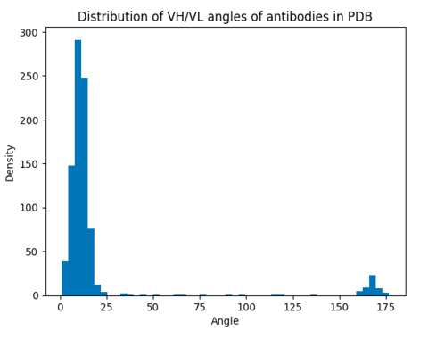

# Submission Documentation
Our team (Erik, Jan, Ali, Alex, Augustin) pursued two separate approaches:
1. Creating a custom potential, that guides the VL-VH angle towards an empirical angle distributione extracted from PDBase (work not completed)
2. Optimizing which model output metrics should be used for ranking the predicted structures

## Antibody Angle Potential
We wanted to impose constraints on the the angles between the antibody variable heavy (VH) and variable light (VL) domains, based on an idea by
Dunbar et al. https://doi.org/10.1093/protein/gzt020
They determined 8 residues per chain that define a plane for a

**Heavy chain positions with 'H' prefix**
(heavy_chain_positions = ['H36', 'H37', 'H38', 'H39', 'H89', 'H90', 'H91', 'H92'])

**Light chain positions with 'L' prefix**
(light_chain_positions = ['L35', 'L36', 'L37', 'L38', 'L85', 'L86', 'L87', 'L88'])

In order to determine the distribution of experimentally determined VH / VL orientation angles we first downloaded a set of non-redundant antibody structures from the PDB using SAbDab (https://doi.org/10.1093/nar/gkab1050) with the following filter parameters:
```
Max. sequence identity (%): 90%
Paired VH/VL only? yes
In complex? yes
Resolution cutoff: 3A
R-factor cutoff: 0.2
```

This resulted in 1112 structures. We filtered for structures with complete heavy and light chains and got 879 structures that were used to determine the angle distributions.

We found the distribution of angles to be bi-modal with two means at 10.8 and 166.83 degrees. Since the number of structures in the high angle distribution was a lot smaller and we didnt have time to investigate the reason for the bimodality we decided to only use the low mean angle distribution for the constraint.



Then the idea was to add a constraint in the form of a potential to the diffusion steering module that enforces the VH/VL angle to be between 
mean+- 1 standard deviation. Unfortunately we did not manage to implement this in the limited time. Current (not working) code can be found on `branch conf_grads`.

### Encountered problems

Potential & Guidance code has very limited documentation, hard to understand in limited hackathon time. **A simple example potential with documentation would be very valuable.**

## Ranking Metric Optimization


